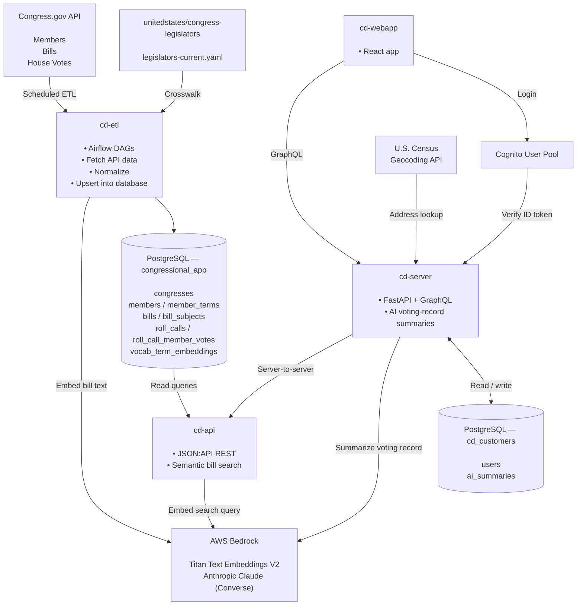

# CD-Platform

A civic data platform built with Apache Airflow, PostgreSQL and FastAPI.

## Architecture

```mermaid
graph TD
    A["Congress.gov API<br/><br/>Members<br/>Bills<br/>House Votes"] -->|Scheduled ETL| B["cd-etl<br/><br/>• Airflow DAGs<br/>• Fetch API data<br/>• Normalize<br/>• Upsert into database"]
    E["unitedstates/congress-legislators<br/><br/>legislators-current.yaml"] -->|Crosswalk| B
    B -->|Embed bill text| H["AWS Bedrock<br/><br/>Titan Text Embeddings V2<br/>Anthropic Claude (Converse)"]
    B --> C[("PostgreSQL — congressional_app<br/><br/>congresses<br/>members / member_terms<br/>bills / bill_subjects<br/>roll_calls / roll_call_member_votes<br/>vocab_term_embeddings")]
    C -->|Read queries| D["cd-api<br/><br/>• JSON:API REST<br/>• Semantic bill search"]
    D -->|Embed search query| H
    F["cd-webapp<br/><br/>• React app"] -->|GraphQL| G["cd-server<br/><br/>• FastAPI + GraphQL<br/>• AI voting-record summaries"]
    G -->|Server-to-server| D
    G -->|Summarize voting record| H
    G <-->|Read / write| I[("PostgreSQL — cd_customers<br/><br/>users<br/>ai_summaries")]
    F -->|Login| J["Cognito User Pool"]
    J -->|Verify ID token| G
    K["U.S. Census<br/>Geocoding API"] -->|Address lookup| G
```
