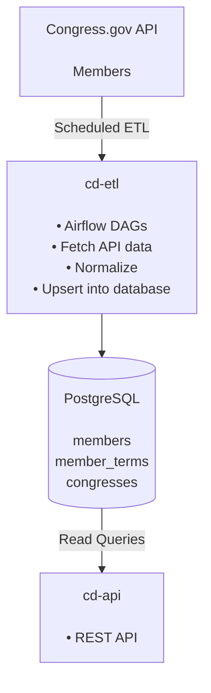

# CD-Platform

A civic data platform built with Apache Airflow and FastAPI.

## Architecture

```mermaid
graph TD
    A["Congress.gov API<br/><br/>Members"] -->|Scheduled ETL| B["cd-etl<br/><br/>• Airflow DAGs<br/>• Fetch API data<br/>• Normalize<br/>• Upsert into database"]
    B --> C[("PostgreSQL<br/><br/>members<br/>member_terms<br/>congresses")]
    C -->|Read Queries| D["cd-api<br/><br/>• REST API"]
```
