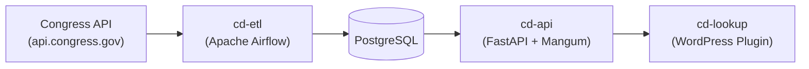

# CD-Platform

Backend for `cd-lookup` WordPress Plugin

## Architecture

```mermaid
graph LR
    A["Congress API<br/>(api.congress.gov)"] --> B["cd-etl<br/>(Apache Airflow)"]
    B --> C[("PostgreSQL")]
    C --> D["cd-api<br/>(FastAPI + Mangum)"]
    D --> E["cd-lookup<br/>(WordPress Plugin)"]
```
